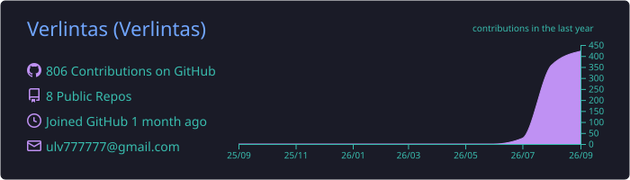
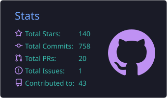

# Verlintas

- Chinese · 北京 / Beijing
- Born 2010 · Full-stack & AI Developer
- Building, breaking, learning, shipping — making anything just for fun.

## About

- 方向：Android 开发、Kotlin Multiplatform、AI 智能体
- 兴趣：安全工具、效率应用、自动化、离线优先架构
- 身份：Founder · Developer · Programmer
- 语言：中文 / English

## Tech Stack

**Languages**

**Platforms**

**Domains**

## Now

- 在做 BetterAIChat：原生 Android AI 智能体（自带 API Key、Shizuku、屏幕分析、语音助手）
- 探索 LLM function-calling 与设备自动化
- 用 Swift / Shell 折腾 macOS 效率工具

## Devices

## Stats

## Get in Touch

